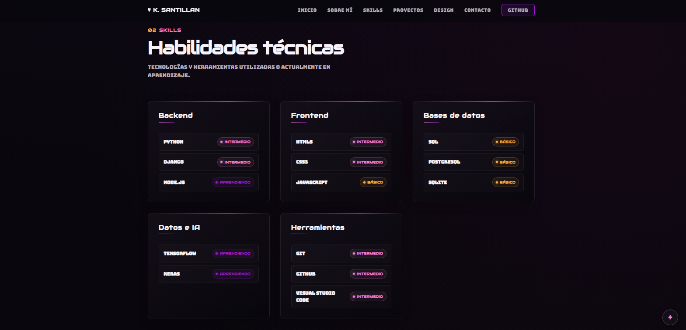
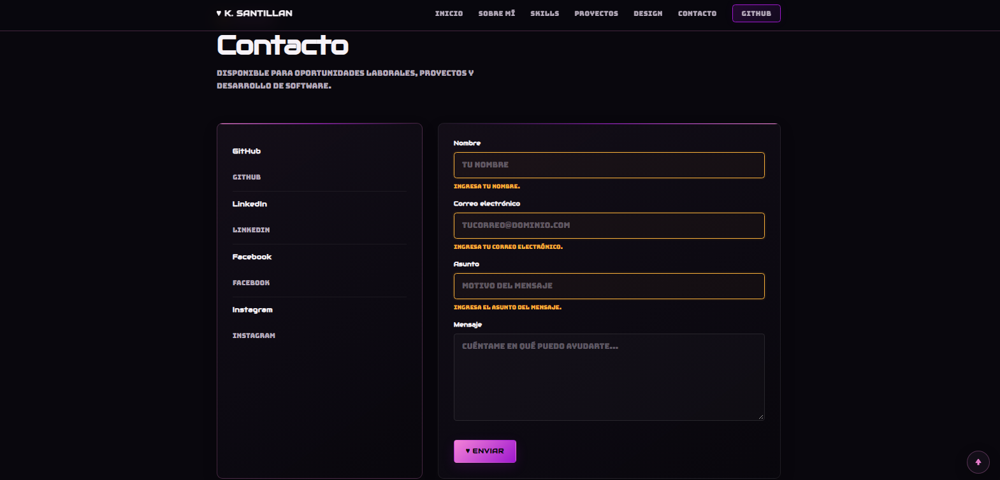

# Portafolio web — Autora:Karla Santillan

Mi portafolio personal, soy estudiante de Ingeniería de Software. Aquí presento mi perfil académico, habilidades técnicas, proyectos y medios de contacto con un diseño adaptable inspirado en videojuegos.

## Secciones

- **Inicio:** presentación y perfil.
- **Sobre mí:** formación académica y enfoque profesional.
- **Habilidades:** tecnologías agrupadas por categoría y nivel.
- **Proyectos:** proyectos destacados con filtros por categoría.
- **Design System:** colores, tipografía, espaciado y componentes.
- **Contacto:** redes sociales y formulario con validación.

## Tecnologías

- **HTML5** para la estructura del portafolio
- **CSS3** para los estilos, diseño adaptable y efectos visuales.
- **JavaScript** para el menú móvil, filtros, botón para volver al inicio y validación del formulario.
- **Google Fonts** para las tipografías.
- **Formspree** para gestionar los envíos del formulario.
- **GitHub Pages** para la publicación del portafolio.
- **Git/GitHub** para el control de versiones y repositorio.

## Estructura del proyecto

```text
Portafolio Karla/
├── index.html
├── README.md
├── css/
│   └── styles.css
├── js/
│   └── script.js
├── assets/
│   └── img/
│       ├── foto carnet Karla.png
│       ├── panel solar.png
│       ├── guioss.png
│       ├── Contacto.png
│       ├── Habilidades.png
│       ├── inicio portafolio.png
│       ├── Sobre mi.png
│       └── Control de inventario.png
```

## Visualización local

El sitio no requiere instalar dependencias.

1. Abre la carpeta del proyecto en Visual Studio Code.
2. Abre `index.html` en un navegador, o usa la extensión **Live Server**.
3. Con Live Server, haz clic derecho en `index.html` y selecciona **Open with Live Server**.


## Capturas del resultado

### Inicio


### Sobre mí


### Habilidades



### Contacto




## Formulario de contacto

El formulario envía los mensajes al endpoint de Formspree configurado en `index.html`. La validación de nombre, correo electrónico, asunto y mensaje se realiza en el navegador mediante JavaScript.

## Funcionalidades de JavaScript

El archivo `js/script.js` agrega interactividad a la página:

- **Menú de navegación:** abre y cierra el menú móvil; actualiza `aria-expanded` y se cierra al seleccionar un enlace o presionar `Escape`.
- **Filtros de proyectos:** muestra los proyectos según su categoría (`backend`, `data` o `ia`). El filtro «Todos» se activa por defecto.
- **Botón para volver al inicio:** aparece después de desplazarse más de 450 píxeles y vuelve al inicio con desplazamiento suave.
- **Validación del formulario:** comprueba que el nombre tenga al menos 2 caracteres, que el correo tenga un formato válido, que el asunto tenga al menos 3 caracteres y que el mensaje tenga al menos 10. Muestra errores junto a los campos y los limpia cuando se editan.

## Características

- Diseño adaptable para distintos tamaños de pantalla.
- Navegación por secciones con menú móvil interactivo.
- Presentación del perfil académico y profesional.
- Habilidades organizadas por categorías y nivel.
- Proyectos con filtros por categoría.
- Sección de sistema de diseño con colores, tipografía y componentes.
- Formulario de contacto con validación y mensajes de error.
- Botón flotante para volver al inicio de la página.


